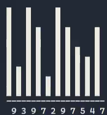
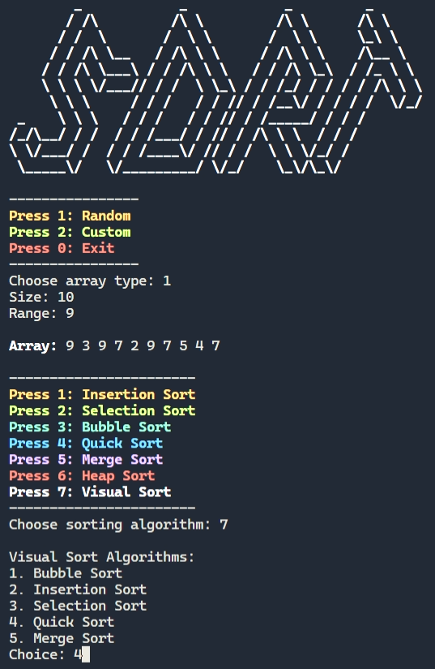

# sort-cli: Interactive Sorting Visualizer and Analyzer

## Overview

**sort-cli** is a C program that allows users to:
- Generate arrays (random or custom)
- Sort them using various algorithms
- Visualize sorting step-by-step (for small arrays)
- View time complexity for each algorithm

This tool is ideal for students, educators, and anyone interested in understanding and comparing sorting algorithms.

---

## Features

- **Array Input:**  
  - Random array (with custom range)
  - Custom array (user input)
- **Sorting Algorithms:**  
  - Insertion Sort  
  - Selection Sort  
  - Bubble Sort  
  - Quick Sort  
  - Merge Sort  
  - Heap Sort  
  - Visual Sort (step-by-step animation for small arrays)
- **Visualization:**  
  - Animated sorting for up to 20 elements using ASCII bars
- **Complexity Display:**  
  - Shows best, average, and worst-case time complexities for each algorithm

---

## Usage

### 1. Compile

```sh
gcc allSorts.c -o allSorts
```

### 2. Run

```sh
./allSorts
```

### 3. Follow Prompts

- **Choose array type:**  
  - Random: Enter size and value range  
  - Custom: Enter size and each element

- **Choose sorting algorithm:**  
  - Select from the menu (1-7)
  - For "Visual Sort", pick the algorithm to visualize

- **View Results:**  
  - Sorted array and time complexity are displayed  
  - For visual sort, watch the sorting process step-by-step

---

## Example

```
----------------
Press 1: Random
Press 2: Custom
Press 0: Exit
----------------
Choose array type: 1
Size: 10
Range: 9

Array: 9 3 9 7 2 9 7 5 4 7

-----------------------
Press 1: Insertion Sort
Press 2: Selection Sort
Press 3: Bubble Sort
Press 4: Quick Sort
Press 5: Merge Sort
Press 6: Heap Sort
Press 7: Visual Sort
-----------------------
Choose sorting algorithm: 7

Visual Sort Algorithms:
1. Bubble Sort
2. Insertion Sort
3. Selection Sort
4. Quick Sort
5. Merge Sort
Choice: 4

```



```
Sorted Array: 2 3 4 5 7 7 7 9 9 9

Worst Case: O(n^2)    Average Case: Θ(nlogn)    Best Case: Ω(nlogn)
```

---

## Screenshots



---

## Notes

- Visualization is limited to the first 20 elements for clarity.
- Works best in terminals that support ANSI escape codes (for colors and clearing screen).
- Tested on Linux and Windows (with compatible terminals).

### ⭐ Star this repo